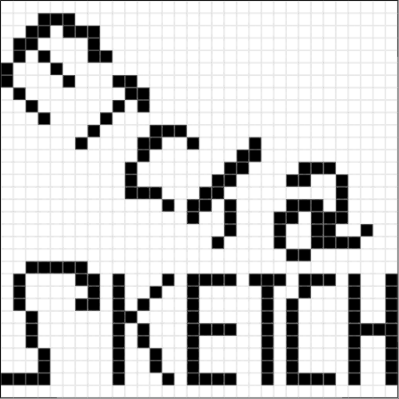

# Etch a Sketch

The third project of **[The Odin Project](https://www.theodinproject.com/)** Etch-a-Sketch web app, where you can draw on a resizable grid and save it.

## Features

- Resizable square grid _from 2x2 to 100x100_
- Holding the mouse to paint on the grid
- Changing pencil's color via a color picker
- A rainbow pencil tool _where you can draw with changing random colors_
- An eraser tool
- Toggle grid view tool
- Save a sketch tool _by the help of **Html2Canvas** external library_

## Learned Outcomes

- CSS principles

- DOM manipulation

- Event delegation

- layout structuring

- Data structures usage

- UI/UX

- Feature building

- External library Handling
